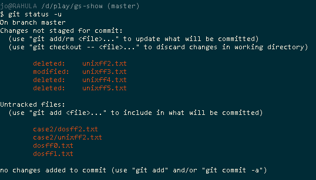

[//]: # ( vim: set fdl=3 fdm=expr:)

gsUntr-unix
===========

A simple Git Bash script built around one line, that (by default) searches the output of `git status -u`, for any as-yet un-committed files with `CRLF` (MSWin, or DOS file-format) line-endings and converts them to simple `LF` (Unix file-format).

I prefer to keep my Git'd files in Unix file-format, even on my Windows 7 netbook, and this script makes the Git commits just a little tidier.

The script handles some usage edge-cases, and allows for some switches to examine what's being done - notes are in the script.

I call it like this `$HOME/gsUntr-unix.sh` - accessible from any Git Bash.

### Requirements
Windows 7 at least, with Git Bash.

### What's caught
With this kind of output:

- find files labelled as "Untracked" (and also as "modified" - might as well) with `CRLF` inside, and change them to `LF`.

